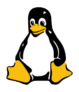

<div style="width: 100%; text-align: center;">
    
</div>

# Linux Users Group
An `HU3120` project.

### Install Requirements
```bash
rustup update # >=1.86.0
rustup target add wasm32-unknown-unknown
cargo install trunk --locked
```
This will output the files necessary to run your app into the `dist` folder; you can then use any static site host to serve these files.

### Development
To locally deploy:
```bash
trunk serve --open
```

### Building
To build a Leptos CSR app for release, use the command:
```bash
trunk build --release
```
Refer to [this](https://github.com/splurf/wlrs-wasm) for more verbose instructions on how to deploy for production.

## Todo
- Rewrite current HTML implementation into using leptos' built-in HTML structures.
- Integrate CSS into rust.
- Add more images/GIFs.
- Add some cool interactive shit
- More pages?
    - interactive terminal
    - mini game(s) (e.g., pong (multiplayer?))
    - fibonacci / prime number / something computationally expensive
    - live preview of data of some sort
    - live chat?
